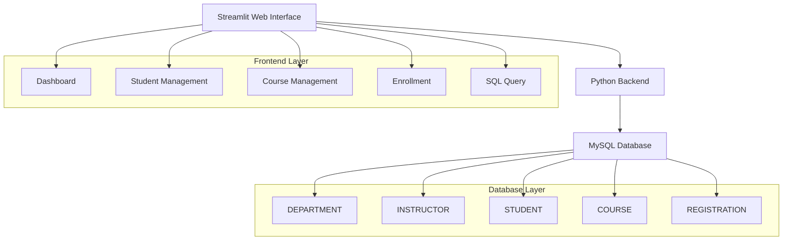

<div align="center">

# University Management System

[](https://python.org)
[](https://streamlit.io)
[](https://mysql.com)
[](LICENSE)

---

## Academic Database Management Platform

A comprehensive web-based system for managing university operations with MySQL database backend and Streamlit frontend interface.

</div>

---

## Key Features

| Module | Functionality | Technology |
|--------|---------------|------------|
| **Student Management** | Registration, profile updates, directory view | Streamlit Forms |
| **Course Catalog** | Course creation, instructor assignment, credit validation | MySQL Tables |
| **Enrollment System** | Course registration, drop operations, semester tracking | SQL Transactions |
| **Dashboard Analytics** | Real-time metrics, activity monitoring | Pandas DataFrames |
| **Query Interface** | Direct SQL execution with templates | MySQL Connector |

---

## System Architecture



**Data Flow:**
- User input → Streamlit form validation → SQL execution → MySQL transaction → Result display with Pandas DataFrames

---

## Installation & Setup

### Prerequisites
- Python 3.8+
- MySQL Server 8.0+
- pip package manager

### Step 1: Clone Repository
```bash
git clone https://github.com/shaheenmohammedsh-ops/University-Management-System.git
cd DB_Project_Code
```

### Step 2: Environment Setup
```bash
# Create virtual environment
python -m venv venv

# Activate environment
# Windows:
venv\Scripts\activate
# macOS/Linux:
source venv/bin/activate

# Install dependencies
pip install -r requirements.txt
```

### Step 3: Database Configuration
```bash
# Launch MySQL shell
mysql -u root -p

# Create database
CREATE DATABASE UniversityDB;

# Import schema and data
mysql -u root -p UniversityDB < UniversityDB_Schema.sql
mysql -u root -p UniversityDB < UniversityDB_Data.sql
```

### Step 4: Application Configuration
Edit `app.py` and update database credentials:
```python
# Line 64 - Update connection parameters
return mysql.connector.connect(
    host="localhost",
    user="your_username",
    password="your_password",
    database="UniversityDB"
)
```

### Step 5: Launch Application
```bash
streamlit run app.py
```

**Access URL:** http://localhost:8501

---

## Usage Guide

### Workflow Example: Register a Student in a Course

**Step 1:** Navigate to **Student Management** → **Register New Student** tab
- Fill in: First Name, Last Name, Email, Phone, Date of Birth, Enrollment Year, Department
- Click **"Save Student Record"**

**Step 2:** Go to **Course Management** → **View Catalog** to verify courses

**Step 3:** Select **Enrollment Management** → **Register Student** tab
- Choose the newly created student from dropdown
- Select a course
- Click **"Confirm Registration"**

**Step 4:** Verify in **Dashboard** → Recent Activity Log shows the new registration

### Code Snippet: Programmatic Student Registration
```python
import mysql.connector
import pandas as pd

# Connect to database
conn = mysql.connector.connect(
    host="localhost",
    user="root",
    password="your_password",
    database="UniversityDB"
)
cursor = conn.cursor()

# Register student in course
student_id = 1
course_code = '022400202'
semester = 'Spring 2025'

cursor.execute(
    "INSERT INTO REGISTRATION (StudentID, CourseCode, Semester) VALUES (%s, %s, %s)",
    (student_id, course_code, semester)
)
conn.commit()

# Verify enrollment
df = pd.read_sql(
    "SELECT c.CourseTitle, r.Semester FROM REGISTRATION r "
    "JOIN COURSE c ON r.CourseCode = c.CourseCode WHERE r.StudentID = %s",
    conn
)
print(df)
conn.close()
```

---

## User Interface Gallery

### System Dashboard
<div align="center">

</div>

*Real-time metrics display with student count, active courses, faculty members, and recent enrollment activities.*

---

### Student Management

#### Registration Interface
<div align="center">

</div>

*Comprehensive form for new student registration with validation and auto-clearing functionality.*

#### Record Management
<div align="center">

</div>

*Edit and delete operations with confirmation dialogs and data integrity checks.*

#### Student Directory
<div align="center">

</div>

*Complete student database view with sortable columns and search capabilities.*

---

### Course Management

#### Course Creation
<div align="center">

</div>

*Form interface for adding new courses with department and instructor assignments.*

#### Course Administration
<div align="center">

</div>

*Edit and delete course information with bulk operations support.*

#### Course Catalog
<div align="center">

</div>

*Complete course listing with filtering and search functionality.*

---

### Enrollment Operations

#### Course Registration
<div align="center">

</div>

*Student enrollment interface with duplicate prevention and validation.*

#### Course Withdrawal
<div align="center">

</div>

*Drop course functionality with immediate database updates.*

---

### Database Query Interface

<div align="center">

</div>

*Direct SQL execution with pre-built templates and result visualization.*

---

## Database Schema

### Entity Relationship Diagram
<div align="center">

</div>

### Schema Structure
<div align="center">

</div>

---

## Database Design

### Table Architecture

#### DEPARTMENT Table
```sql
CREATE TABLE DEPARTMENT (
    DeptID VARCHAR(10) PRIMARY KEY,
    DeptName VARCHAR(100) UNIQUE NOT NULL,
    BuildingLocation VARCHAR(50)
);
```

#### INSTRUCTOR Table
```sql
CREATE TABLE INSTRUCTOR (
    InstructorID INT AUTO_INCREMENT PRIMARY KEY,
    FirstName VARCHAR(50) NOT NULL,
    LastName VARCHAR(50) NOT NULL,
    Email VARCHAR(100) UNIQUE NOT NULL,
    HireDate DATE,
    DeptID VARCHAR(10),
    FOREIGN KEY (DeptID) REFERENCES DEPARTMENT(DeptID)
        ON DELETE SET NULL
);
```

#### STUDENT Table
```sql
CREATE TABLE STUDENT (
    StudentID INT AUTO_INCREMENT PRIMARY KEY,
    FirstName VARCHAR(50) NOT NULL,
    LastName VARCHAR(50) NOT NULL,
    Email VARCHAR(100) UNIQUE NOT NULL,
    Phone VARCHAR(20),
    DateOfBirth DATE,
    EnrollmentYear INT,
    DeptID VARCHAR(10),
    FOREIGN KEY (DeptID) REFERENCES DEPARTMENT(DeptID)
        ON DELETE SET NULL
);
```

#### COURSE Table
```sql
CREATE TABLE COURSE (
    CourseCode VARCHAR(10) PRIMARY KEY,
    CourseTitle VARCHAR(100) NOT NULL,
    Credits INT CHECK (Credits BETWEEN 1 AND 6),
    Description TEXT,
    DeptID VARCHAR(10),
    InstructorID INT,
    FOREIGN KEY (DeptID) REFERENCES DEPARTMENT(DeptID)
        ON DELETE SET NULL,
    FOREIGN KEY (InstructorID) REFERENCES INSTRUCTOR(InstructorID)
        ON DELETE SET NULL
);
```

#### REGISTRATION Table
```sql
CREATE TABLE REGISTRATION (
    RegistrationID INT AUTO_INCREMENT PRIMARY KEY,
    Semester VARCHAR(20) NOT NULL,
    Grade CHAR(2),
    RegistrationDate DATETIME DEFAULT CURRENT_TIMESTAMP,
    StudentID INT,
    CourseCode VARCHAR(10),
    FOREIGN KEY (StudentID) REFERENCES STUDENT(StudentID)
        ON DELETE CASCADE,
    FOREIGN KEY (CourseCode) REFERENCES COURSE(CourseCode)
        ON DELETE CASCADE,
    UNIQUE (StudentID, CourseCode, Semester)
);
```

### Relationships & Constraints

| Relationship | Type | Rule | Impact |
|------------|------|------|--------|
| DEPARTMENT ← INSTRUCTOR | One-to-Many | ON DELETE SET NULL | Preserve instructors when dept deleted |
| DEPARTMENT ← STUDENT | One-to-Many | ON DELETE SET NULL | Preserve students when dept deleted |
| DEPARTMENT ← COURSE | One-to-Many | ON DELETE SET NULL | Preserve courses when dept deleted |
| INSTRUCTOR ← COURSE | One-to-Many | ON DELETE SET NULL | Courses retain history when instructor deleted |
| STUDENT → REGISTRATION | One-to-Many | ON DELETE CASCADE | Drop all registrations when student deleted |
| COURSE → REGISTRATION | One-to-Many | ON DELETE CASCADE | Remove registrations when course deleted |

### Data Integrity Features

- **Unique Constraints**: Email fields (STUDENT, INSTRUCTOR) prevent duplicates
- **Check Constraints**: Course credits limited to 1-6 range
- **Foreign Keys**: All relationships enforced with referential integrity
- **Timestamps**: Automatic registration date tracking via CURRENT_TIMESTAMP
- **Auto-Increment**: Primary keys auto-generate for STUDENT, INSTRUCTOR, REGISTRATION
- **InnoDB Engine**: Transactional consistency and ACID compliance

---

## Technical Specifications

### System Requirements
- **Operating System:** Windows 10+, macOS 10.14+, Ubuntu 18.04+
- **Python Version:** 3.8 or higher
- **MySQL Version:** 8.0 or higher
- **Memory:** Minimum 4GB RAM
- **Storage:** 500MB available space

### Performance Features
- **Transaction Safety:** ACID compliance with InnoDB engine
- **Data Integrity:** Foreign key constraints and validation rules
- **Duplicate Prevention:** Unique constraints on critical fields
- **Audit Trail:** Automatic timestamp tracking

### Security Considerations
- **Input Validation:** Form sanitization and SQL injection prevention
- **Data Protection:** Referential integrity enforcement
- **Access Control:** Connection-based authentication

---

## Usage Examples

### Programmatic Student Registration
```python
import mysql.connector
import pandas as pd

# Database connection
conn = mysql.connector.connect(
    host="localhost",
    user="your_username",
    password="your_password",
    database="UniversityDB"
)

# Register new student
cursor = conn.cursor()
student_data = (
    "John", "Doe", "john.doe@university.edu",
    "555-0123", "2000-01-15", 2023, "CS"
)

cursor.execute("""
    INSERT INTO STUDENT (FirstName, LastName, Email, Phone, DateOfBirth, EnrollmentYear, DeptID)
    VALUES (%s, %s, %s, %s, %s, %s, %s)
""", student_data)

conn.commit()
print(f"Student registered with ID: {cursor.lastrowid}")
conn.close()
```

### Advanced Query Example
```python
# Get enrollment statistics
query = """
SELECT 
    d.DeptName,
    COUNT(DISTINCT s.StudentID) as StudentCount,
    COUNT(DISTINCT c.CourseCode) as CourseCount,
    COUNT(r.RegistrationID) as TotalEnrollments
FROM DEPARTMENT d
LEFT JOIN STUDENT s ON d.DeptID = s.DeptID
LEFT JOIN COURSE c ON d.DeptID = c.DeptID
LEFT JOIN REGISTRATION r ON c.CourseCode = r.CourseCode
GROUP BY d.DeptID, d.DeptName
ORDER BY TotalEnrollments DESC;
"""

df = pd.read_sql(query, conn)
print(df)
```

---

## Development Workflow

### Project Structure
```
DB_Project_Code/
├── app.py                 # Main Streamlit application
├── requirements.txt       # Python dependencies
├── UniversityDB_Schema.sql # Database schema
├── UniversityDB_Data.sql   # Sample data
├── UniversityDB_Queries.sql # Pre-built queries
├── images/               # UI screenshots
│   ├── 1.png            # Dashboard
│   ├── 2.png            # Student registration
│   ├── 3.png            # Student management
│   ├── 4.png            # Student directory
│   ├── 5.png            # Course creation
│   ├── 6.png            # Course management
│   ├── 7.png            # Course catalog
│   ├── 8.png            # Course withdrawal
│   ├── 9.png            # Course registration
│   ├── 10.png           # Query interface
│   ├── 11.jpeg          # Database schema
│   └── 12.jpeg          # ERD diagram
└── README.md            # Project documentation
```

### Contributing Guidelines
1. Fork the repository
2. Create feature branch: `git checkout -b feature/new-feature`
3. Commit changes: `git commit -m 'Add feature description'`
4. Push to branch: `git push origin feature/new-feature`
5. Submit Pull Request

### Development Areas
- Additional reporting modules
- Performance optimization
- User authentication system
- REST API development
- Unit test implementation

---

## Project Metrics

### Code Statistics
- **Lines of Code:** ~470 (Python)
- **Database Tables:** 5
- **UI Screens:** 10
- **Pre-built Queries:** 15

### Database Scale
- **Departments:** 6 records
- **Instructors:** 4 records  
- **Students:** 3+ records
- **Courses:** 7+ records
---

## Troubleshooting

### Common Issues

#### Database Connection Error
```bash
# Check MySQL service status
sudo systemctl status mysql  # Linux
brew services list mysql     # macOS
# Windows: Check Services app
```

#### Port Already in Use
```bash
# Find process using port 8501
netstat -ano | findstr :8501  # Windows
lsof -i :8501                 # macOS/Linux

# Kill process
taskkill /PID <PID> /F        # Windows
kill -9 <PID>                 # macOS/Linux
```

#### Module Import Error
```bash
# Reinstall dependencies
pip install -r requirements.txt --force-reinstall
```

---

## License

This project is licensed under the MIT License - see the [LICENSE](LICENSE) file for details.

---

## Acknowledgments

- **Streamlit Team** - Excellent web application framework
- **MySQL Community** - Robust database management system
- **Pandas Developers** - Powerful data manipulation library

---

<div align="center">

## Support & Contact

For questions, issues, or contributions:
- Email: shaheenmohammedsh@gmail.com
- Issues: [GitHub Issues](https://github.com/shaheenmohammedsh-ops/University-Management-System/issues)
- Documentation: [Project Wiki](https://github.com/shaheenmohammedsh-ops/University-Management-System/wiki)

---

**Built with dedication for educational institutions**

[Back to Top](#-university-management-system)

</div>
