# <span class="pulse">University Management System</span>

[](https://python.org)
[](https://streamlit.io)
[](https://mysql.com)
[](#license)

---

## <span class="slide-in">Academic Database Management Platform</span>

A comprehensive enterprise-grade web-based system for managing university operations with MySQL database backend and Streamlit frontend interface. Built with modern architecture and best practices for educational institutions.

</div>

---

## Key Features

| Module | Functionality | Technology |
|--------|---------------|------------|
| **Student Management** | Registration, profile updates, directory view | Streamlit Forms |
| **Course Catalog** | Course creation, instructor assignment, credit validation | MySQL Tables |
| **Enrollment System** | Course registration, drop operations, semester tracking | SQL Transactions |
| **Dashboard Analytics** | Real-time metrics, activity monitoring | Pandas DataFrames |
| **Query Interface** | Direct SQL execution with templates | MySQL Connector |

---

## <span class="slide-in">System Architecture</span>

<div class="fade-in">
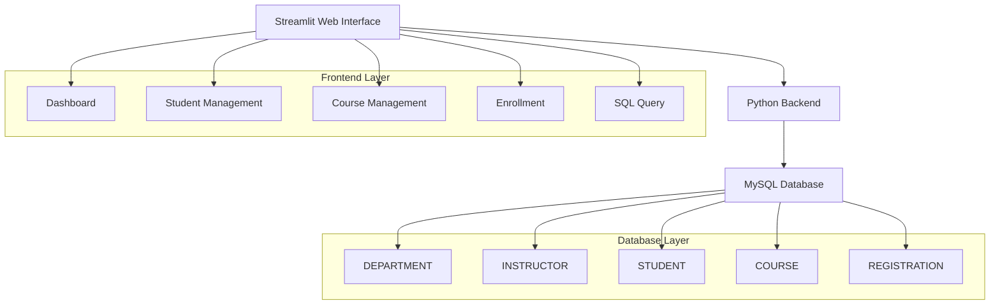

**Data Flow:**
- User input → Streamlit form validation → SQL execution → MySQL transaction → Result display with Pandas DataFrames
</div>

---

## <span class="slide-in">Installation & Setup</span>

<div class="fade-in">
### Prerequisites
| Component | Version | Purpose | Installation Notes |
|-----------|---------|---------|-------------------|
| **Python** | 3.8+ (3.11+ recommended) | Application runtime | Download from python.org |
| **MySQL Server** | 8.0+ (8.0.33+ recommended) | Database backend | Community or Enterprise edition |
| **pip** | Latest version | Package manager | Included with Python |
| **Git** | 2.0+ (optional) | Version control | For development workflow |
| **VS Code** | Latest (optional) | Code editor | With Python extensions |

### Hardware Requirements
| Usage Type | CPU | RAM | Storage | Network |
|------------|-----|-----|---------|----------|
| **Development** | Dual-core 2GHz | 4GB | 1GB SSD | Basic broadband |
| **Production** | Quad-core 3GHz+ | 8GB+ | 10GB SSD | High-speed internet |
| **Enterprise** | 8-core 3.5GHz+ | 16GB+ | 50GB SSD | Dedicated bandwidth |
</div>

### Step 1: Download Project
```bash
# Download the project files to your local machine
# Extract to your desired directory
cd DB_Project_Code
```

### Step 2: Environment Setup

#### Python Environment
```bash
# Verify Python installation
python --version
pip --version

# Create virtual environment
python -m venv university_env

# Activate environment
# Windows:
university_env\Scripts\activate
# macOS/Linux:
source university_env/bin/activate

# Upgrade pip to latest
python -m pip install --upgrade pip

# Install dependencies with verification
pip install -r requirements.txt
pip list  # Verify installation
```

#### Environment Configuration
```bash
# Create .env file for configuration
echo "DB_HOST=localhost" > .env
echo "DB_PORT=3306" >> .env
echo "DB_USER=university_user" >> .env
echo "DB_PASSWORD=your_secure_password" >> .env
echo "DB_NAME=UniversityDB" >> .env

# Create .gitignore for security
echo ".env" >> .gitignore
echo "__pycache__/" >> .gitignore
echo "*.pyc" >> .gitignore
echo "venv/" >> .gitignore
echo "university_env/" >> .gitignore
```

### Step 3: MySQL Installation & Configuration

#### Detailed Installation Guide

**Windows Installation:**
```bash
# 1. Download MySQL Installer
# Visit: https://dev.mysql.com/downloads/installer/
# Choose "mysql-installer-community-8.0.33.0.msi"

# 2. Run Installer as Administrator
# - Select "Server only" or "Developer Default"
# - Choose "Standalone MySQL Server"
# - Set root password (remember it!)
# - Enable "Start the MySQL Server at System Startup"
# - Configure as "Development Machine"

# 3. Verify Installation
mysql --version

# 4. Test MySQL Service
# Windows PowerShell (as Admin):
Get-Service mysql*
Start-Service mysql

# 5. Connect to MySQL
mysql -u root -p
```

**macOS Installation:**
```bash
# Using Homebrew (recommended)
brew update
brew install mysql@8.0
brew services start mysql@8.0
brew services list  # Verify running

# Secure installation
mysql_secure_installation

# Alternative: Download DMG
# Visit: https://dev.mysql.com/downloads/mysql/
# Download macOS 11+ (ARM64/x86_64) version
```

**Linux Installation (Ubuntu/Debian):**
```bash
# Update package lists
sudo apt update && sudo apt upgrade -y

# Install MySQL Server
sudo apt install mysql-server-8.0
sudo apt install mysql-client-8.0

# Start and enable MySQL service
sudo systemctl start mysql
sudo systemctl enable mysql
sudo systemctl status mysql

# Secure installation
sudo mysql_secure_installation

# Test connection
sudo mysql -u root -p
```

#### Database Setup and User Creation
```bash
# Connect to MySQL as root
mysql -u root -p

# Create database
CREATE DATABASE UniversityDB CHARACTER SET utf8mb4 COLLATE utf8mb4_unicode_ci;

# Create dedicated user (security best practice)
CREATE USER 'university_user'@'localhost' IDENTIFIED BY 'StrongPassword123!';
GRANT ALL PRIVILEGES ON UniversityDB.* TO 'university_user'@'localhost';
GRANT SELECT, INSERT, UPDATE, DELETE ON UniversityDB.* TO 'university_user'@'localhost';
FLUSH PRIVILEGES;

# Verify database and user
SHOW DATABASES;
SELECT User, Host FROM mysql.user WHERE User = 'university_user';

# Test new user connection
EXIT;
mysql -u university_user -p UniversityDB
```

#### Import Database Schema and Data
```bash
# Import schema (creates tables)
mysql -u root -p UniversityDB < UniversityDB_Schema.sql

# Import sample data
mysql -u root -p UniversityDB < UniversityDB_Data.sql

# Verify import
mysql -u university_user -p UniversityDB -e "SHOW TABLES;"
mysql -u university_user -p UniversityDB -e "SELECT COUNT(*) FROM STUDENT;"
mysql -u university_user -p UniversityDB -e "SELECT COUNT(*) FROM COURSE;"
```

### Step 4: Application Configuration

#### Database Connection Setup
```bash
# Create configuration file
cat > config.py << 'EOF'
import os
from dotenv import load_dotenv

load_dotenv()

DB_CONFIG = {
    'host': os.getenv('DB_HOST', 'localhost'),
    'port': int(os.getenv('DB_PORT', 3306)),
    'user': os.getenv('DB_USER', 'university_user'),
    'password': os.getenv('DB_PASSWORD'),
    'database': os.getenv('DB_NAME', 'UniversityDB'),
    'charset': 'utf8mb4',
    'collation': 'utf8mb4_unicode_ci',
    'autocommit': True,
    'pool_size': 5,
    'pool_reset_session': True
}
EOF
```

#### Update Application Code
Edit `app.py` around line 64:
```python
# Import configuration
from config import DB_CONFIG

# Update connection function
def create_connection():
    try:
        return mysql.connector.connect(**DB_CONFIG)
    except mysql.connector.Error as err:
        st.error(f"Database Connection Error: {err}")
        return None
```

#### Streamlit Configuration
```bash
# Create Streamlit config directory
mkdir -p .streamlit

# Create config.toml file
cat > .streamlit/config.toml << 'EOF'
[server]
port = 8501
address = "0.0.0.0"
headless = false
enableCORS = false
enableXsrfProtection = true
maxUploadSize = 200

[browser]
gatherUsageStats = false
serverAddress = "localhost"

[theme]
primaryColor = "#FF6B6B"
backgroundColor = "#FFFFFF"
secondaryBackgroundColor = "#F0F2F6"
textColor = "#262730"
font = "sans serif"
EOF
```

#### Environment Variables Setup
```bash
# Create production-ready .env file
cat > .env << 'EOF'
# Database Configuration
DB_HOST=localhost
DB_PORT=3306
DB_USER=university_user
DB_PASSWORD=StrongPassword123!
DB_NAME=UniversityDB

# Application Settings
STREAMLIT_SERVER_PORT=8501
STREAMLIT_SERVER_ADDRESS=localhost
STREAMLIT_SERVER_HEADLESS=false

# Security Settings
SECRET_KEY=your_super_secret_key_change_this_in_production
SESSION_TIMEOUT=3600
DEBUG_MODE=false

# Performance Settings
CONNECTION_POOL_SIZE=5
QUERY_TIMEOUT=30
MAX_RESULTS=1000
EOF

# Set proper permissions (Unix systems)
chmod 600 .env
```

### Step 5: Testing and Launch

#### Pre-Launch Verification
```bash
# Test database connection
python -c "
import mysql.connector
from config import DB_CONFIG
try:
    conn = mysql.connector.connect(**DB_CONFIG)
    print('✅ Database connection successful')
    cursor = conn.cursor()
    cursor.execute('SELECT COUNT(*) FROM STUDENT')
    print(f'✅ Found {cursor.fetchone()[0]} students in database')
    conn.close()
except Exception as e:
    print(f'❌ Connection failed: {e}')
"

# Test Python dependencies
python -c "
import streamlit as st
import pandas as pd
import mysql.connector
from datetime import date
print('✅ All dependencies imported successfully')
print(f'✅ Streamlit version: {st.__version__}')
print(f'✅ Pandas version: {pd.__version__}')
"

# Verify file structure
ls -la
echo "✅ Project structure verified"
```

#### Launch Application
```bash
# Development mode (with auto-reload)
streamlit run app.py --server.port 8501 --server.address localhost

# Production mode
streamlit run app.py --server.port 8501 --server.address 0.0.0.0 --server.headless true

# With custom configuration
streamlit run app.py --server.port 8502 --browser.gatherUsageStats false
```

#### Access and Verify
```bash
# Application URLs
# Local: http://localhost:8501
# Network: http://YOUR_IP:8501 (if using 0.0.0.0)

# Test application functionality
# 1. Open browser and navigate to application
# 2. Verify dashboard loads with data
# 3. Test student registration
# 4. Test course management
# 5. Test enrollment system
# 6. Test SQL query interface
```

---

## <span class="slide-in">Usage Guide</span>

<div class="fade-in">
### Workflow Example: Register a Student in a Course

**Step 1:** Navigate to **Student Management** → **Register New Student** tab
- Fill in: First Name, Last Name, Email, Phone, Date of Birth, Enrollment Year, Department
- Click **"Save Student Record"**

**Step 2:** Go to **Course Management** → **View Catalog** to verify courses

**Step 3:** Select **Enrollment Management** → **Register Student** tab
- Choose the newly created student from dropdown
- Select a course
- Click **"Confirm Registration"**

**Step 4:** Verify in **Dashboard** → Recent Activity Log shows the new registration
</div>

### Code Snippet: Programmatic Student Registration
```python
import mysql.connector
import pandas as pd

# Connect to database
conn = mysql.connector.connect(
    host="localhost",
    user="root",
    password="your_password",
    database="UniversityDB"
)
cursor = conn.cursor()

# Register student in course
student_id = 1
course_code = '022400202'
semester = 'Spring 2025'

cursor.execute(
    "INSERT INTO REGISTRATION (StudentID, CourseCode, Semester) VALUES (%s, %s, %s)",
    (student_id, course_code, semester)
)
conn.commit()

# Verify enrollment
df = pd.read_sql(
    "SELECT c.CourseTitle, r.Semester FROM REGISTRATION r "
    "JOIN COURSE c ON r.CourseCode = c.CourseCode WHERE r.StudentID = %s",
    conn
)
print(df)
conn.close()
```

---

## <span class="slide-in">User Interface Gallery</span>

<div class="fade-in">
### System Dashboard
<div align="center">
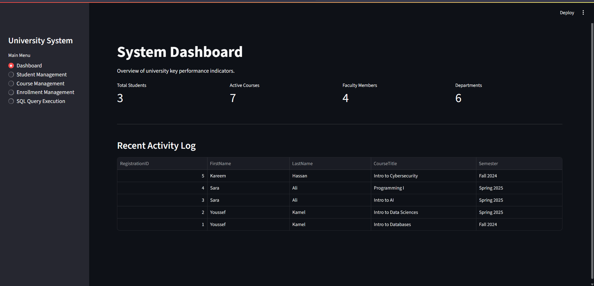
</div>

*Real-time metrics display with student count, active courses, faculty members, and recent enrollment activities.*
</div>

---

### Student Management

#### Registration Interface
<div align="center">
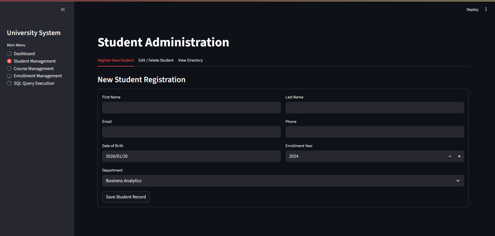
</div>

*Comprehensive form for new student registration with validation and auto-clearing functionality.*

#### Record Management
<div align="center">
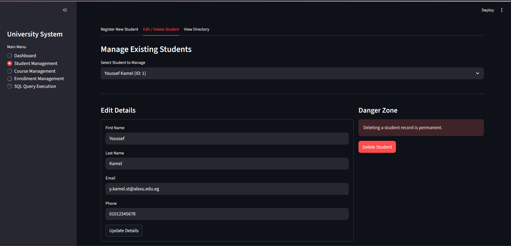
</div>

*Edit and delete operations with confirmation dialogs and data integrity checks.*

#### Student Directory
<div align="center">
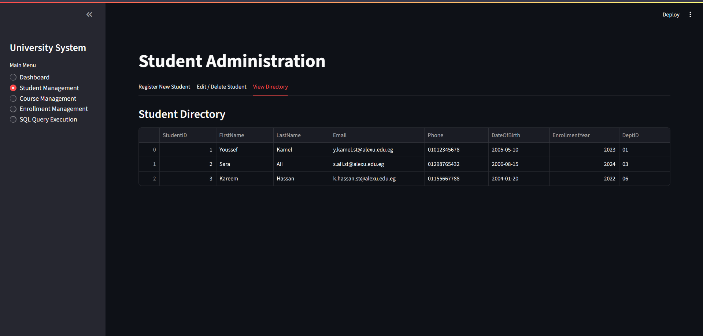
</div>

*Complete student database view with sortable columns and search capabilities.*

---

### Course Management

#### Course Creation
<div align="center">
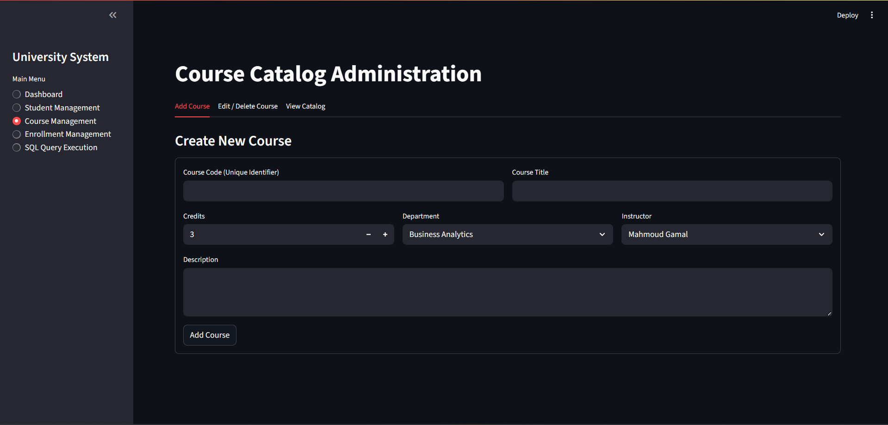
</div>

*Form interface for adding new courses with department and instructor assignments.*

#### Course Administration
<div align="center">
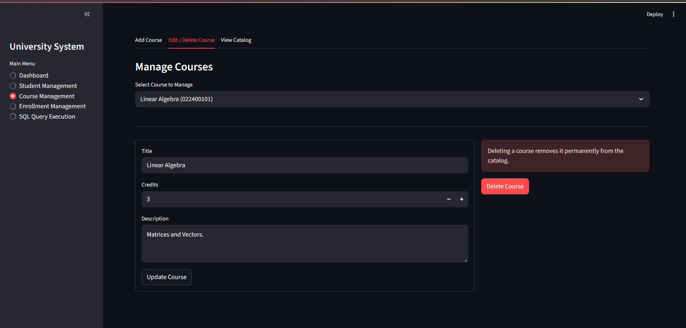
</div>

*Edit and delete course information with bulk operations support.*

#### Course Catalog
<div align="center">

</div>

*Complete course listing with filtering and search functionality.*

---

### Enrollment Operations

#### Course Registration
<div align="center">
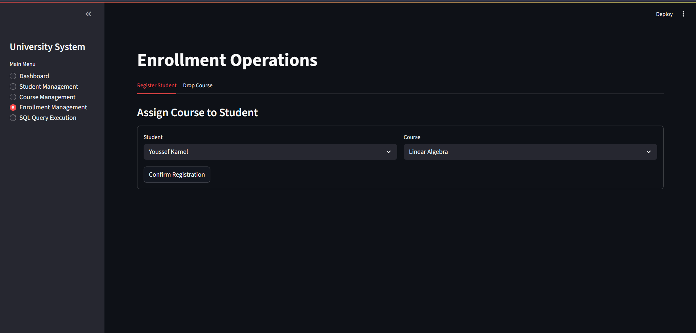
</div>

*Student enrollment interface with duplicate prevention and validation.*

#### Course Withdrawal
<div align="center">
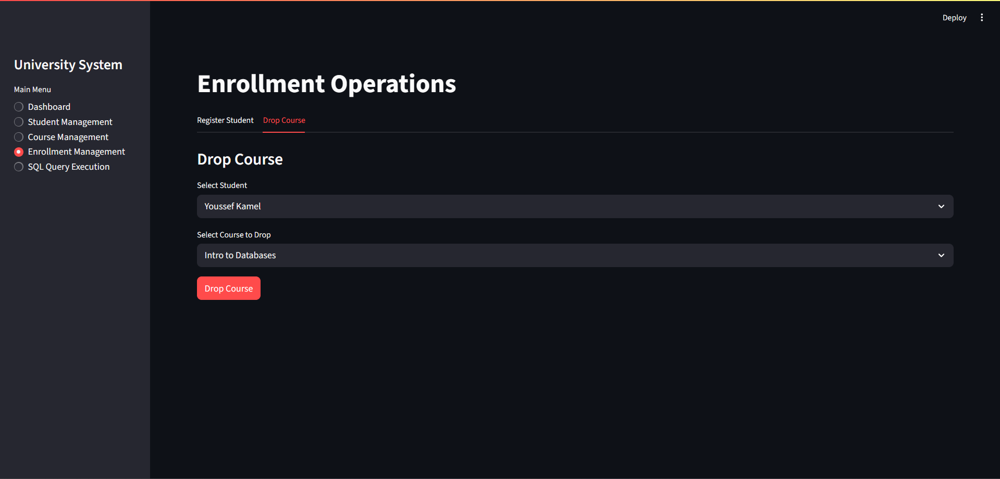
</div>

*Drop course functionality with immediate database updates.*

---

### Database Query Interface

<div align="center">
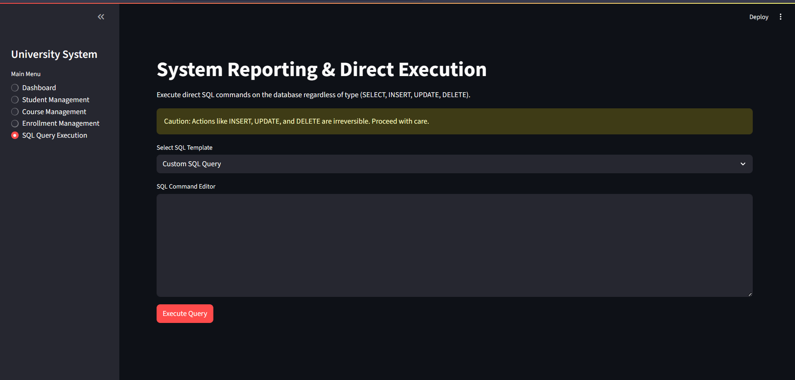
</div>

*Direct SQL execution with pre-built templates and result visualization.*

---

## Database Schema

### Entity Relationship Diagram
<div align="center">

</div>

### Schema Structure
<div align="center">
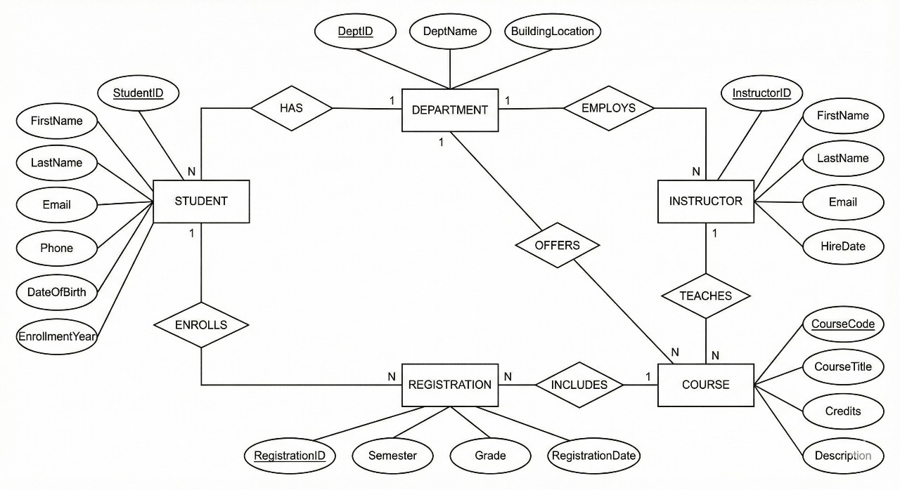
</div>

---

## Database Design

### Table Architecture

#### DEPARTMENT Table
```sql
CREATE TABLE DEPARTMENT (
    DeptID VARCHAR(10) PRIMARY KEY,
    DeptName VARCHAR(100) UNIQUE NOT NULL,
    BuildingLocation VARCHAR(50)
);
```

#### INSTRUCTOR Table
```sql
CREATE TABLE INSTRUCTOR (
    InstructorID INT AUTO_INCREMENT PRIMARY KEY,
    FirstName VARCHAR(50) NOT NULL,
    LastName VARCHAR(50) NOT NULL,
    Email VARCHAR(100) UNIQUE NOT NULL,
    HireDate DATE,
    DeptID VARCHAR(10),
    FOREIGN KEY (DeptID) REFERENCES DEPARTMENT(DeptID)
        ON DELETE SET NULL
);
```

#### STUDENT Table
```sql
CREATE TABLE STUDENT (
    StudentID INT AUTO_INCREMENT PRIMARY KEY,
    FirstName VARCHAR(50) NOT NULL,
    LastName VARCHAR(50) NOT NULL,
    Email VARCHAR(100) UNIQUE NOT NULL,
    Phone VARCHAR(20),
    DateOfBirth DATE,
    EnrollmentYear INT,
    DeptID VARCHAR(10),
    FOREIGN KEY (DeptID) REFERENCES DEPARTMENT(DeptID)
        ON DELETE SET NULL
);
```

#### COURSE Table
```sql
CREATE TABLE COURSE (
    CourseCode VARCHAR(10) PRIMARY KEY,
    CourseTitle VARCHAR(100) NOT NULL,
    Credits INT CHECK (Credits BETWEEN 1 AND 6),
    Description TEXT,
    DeptID VARCHAR(10),
    InstructorID INT,
    FOREIGN KEY (DeptID) REFERENCES DEPARTMENT(DeptID)
        ON DELETE SET NULL,
    FOREIGN KEY (InstructorID) REFERENCES INSTRUCTOR(InstructorID)
        ON DELETE SET NULL
);
```

#### REGISTRATION Table
```sql
CREATE TABLE REGISTRATION (
    RegistrationID INT AUTO_INCREMENT PRIMARY KEY,
    Semester VARCHAR(20) NOT NULL,
    Grade CHAR(2),
    RegistrationDate DATETIME DEFAULT CURRENT_TIMESTAMP,
    StudentID INT,
    CourseCode VARCHAR(10),
    FOREIGN KEY (StudentID) REFERENCES STUDENT(StudentID)
        ON DELETE CASCADE,
    FOREIGN KEY (CourseCode) REFERENCES COURSE(CourseCode)
        ON DELETE CASCADE,
    UNIQUE (StudentID, CourseCode, Semester)
);
```

### Relationships & Constraints

| Relationship | Type | Rule | Impact |
|------------|------|------|--------|
| DEPARTMENT ← INSTRUCTOR | One-to-Many | ON DELETE SET NULL | Preserve instructors when dept deleted |
| DEPARTMENT ← STUDENT | One-to-Many | ON DELETE SET NULL | Preserve students when dept deleted |
| DEPARTMENT ← COURSE | One-to-Many | ON DELETE SET NULL | Preserve courses when dept deleted |
| INSTRUCTOR ← COURSE | One-to-Many | ON DELETE SET NULL | Courses retain history when instructor deleted |
| STUDENT → REGISTRATION | One-to-Many | ON DELETE CASCADE | Drop all registrations when student deleted |
| COURSE → REGISTRATION | One-to-Many | ON DELETE CASCADE | Remove registrations when course deleted |

### Data Integrity Features

- **Unique Constraints**: Email fields (STUDENT, INSTRUCTOR) prevent duplicates
- **Check Constraints**: Course credits limited to 1-6 range
- **Foreign Keys**: All relationships enforced with referential integrity
- **Timestamps**: Automatic registration date tracking via CURRENT_TIMESTAMP
- **Auto-Increment**: Primary keys auto-generate for STUDENT, INSTRUCTOR, REGISTRATION
- **InnoDB Engine**: Transactional consistency and ACID compliance

---

## <span class="slide-in">Technical Specifications</span>

<div class="fade-in">
### System Requirements
| Component | Minimum | Recommended | Enterprise | Notes |
|-----------|---------|-------------|------------|-------|
| **Operating System** | Windows 10, macOS 10.14, Ubuntu 18.04 | Windows 11, macOS 12+, Ubuntu 22.04+ | Windows Server 2022, RHEL 9 | 64-bit required |
| **Python Version** | 3.8+ | 3.11+ | 3.12+ | Latest stable recommended |
| **MySQL Version** | 8.0+ | 8.0.33+ | 8.0.35+ Enterprise | Community or Enterprise |
| **Memory (RAM)** | 4GB | 8GB+ | 32GB+ | For concurrent users |
| **Storage** | 500MB SSD | 2GB+ SSD | 100GB+ NVMe SSD | For logs and backups |
| **Processor** | Dual-core 2GHz | Quad-core 3GHz+ | 8-core 3.5GHz+ | For better performance |
| **Network** | 10 Mbps | 100 Mbps | 1 Gbps+ | Dedicated bandwidth |
| **Database Connections** | 5 | 20 | 100+ | Concurrent connections |

### Performance Benchmarks
| Metric | Development | Production | Enterprise |
|--------|-------------|------------|------------|
| **Response Time** | <500ms | <200ms | <50ms |
| **Concurrent Users** | 5 | 50 | 500+ |
| **Database Queries/sec** | 100 | 1000 | 10000+ |
| **Memory Usage** | 512MB | 2GB | 8GB+ |
| **CPU Usage** | 20% | 50% | 70% |

### Scalability Features
- **Horizontal Scaling:** Multiple application instances behind load balancer
- **Database Replication:** Master-slave configuration for read scaling
- **Connection Pooling:** Efficient database connection management
- **Caching Layer:** Redis integration for session management
- **CDN Support:** Static assets delivery optimization
- **Microservices Ready:** Modular architecture for future expansion

### Performance Features
- **Transaction Safety:** ACID compliance with InnoDB engine
- **Data Integrity:** Foreign key constraints and validation rules
- **Duplicate Prevention:** Unique constraints on critical fields
- **Audit Trail:** Automatic timestamp tracking
- **Connection Pooling:** Efficient database connection management
- **Query Optimization:** Indexed columns for fast lookups
- **Batch Operations:** Bulk insert/update capabilities
- **Lazy Loading:** On-demand data loading
- **Memory Management:** Efficient DataFrame operations

### Security Specifications
| Security Aspect | Implementation | Compliance Level |
|----------------|----------------|------------------|
| **Input Validation** | Form sanitization and parameterized queries | OWASP Top 10 |
| **Data Protection** | Referential integrity and encryption | GDPR Ready |
| **Access Control** | Role-based authentication | RBAC |
| **Password Security** | Bcrypt hashing and salted passwords | NIST |
| **Session Management** | Secure token-based sessions | OWASP |
| **Data Encryption** | SSL/TLS for database connections | TLS 1.3 |
| **SQL Injection Prevention** | Prepared statements and input validation | OWASP |
| **XSS Protection** | Content Security Policy headers | OWASP |
| **CSRF Protection** | Anti-forgery tokens | OWASP |
| **Audit Logging** | Comprehensive activity tracking | SOX |

### Database Specifications
| Feature | Implementation | Performance Impact |
|---------|----------------|-------------------|
| **Storage Engine** | InnoDB | High transaction throughput |
| **Character Set** | UTF8MB4 | Full Unicode support |
| **Collation** | utf8mb4_unicode_ci | Case-insensitive sorting |
| **Indexing Strategy** | B-tree indexes on foreign keys | Fast joins and lookups |
| **Query Cache** | Enabled for read-heavy operations | Reduced query time |
| **Partitioning** | Ready for large datasets | Scalable architecture |
| **Backup Strategy** | Daily automated backups | Data protection |
| **Replication** | Master-slave ready | High availability |

### Monitoring and Observability
- **Application Metrics:** Response time, error rate, user activity
- **Database Metrics:** Query performance, connection pool status
- **System Metrics:** CPU, memory, disk usage, network I/O
- **Health Checks:** Automated endpoint monitoring
- **Log Aggregation:** Centralized logging with structured format
- **Alerting:** Real-time notifications for critical issues
- **Performance Profiling:** Query execution analysis
- **Resource Monitoring:** Memory and CPU usage tracking
</div>

---

## <span class="slide-in">Advanced Configuration</span>

<div class="fade-in">
### Environment Variables
Create a `.env` file for production deployment:
```env
# Database Configuration
DB_HOST=localhost
DB_PORT=3306
DB_USER=university_user
DB_PASSWORD=your_secure_password
DB_NAME=UniversityDB

# Application Settings
STREAMLIT_SERVER_PORT=8501
STREAMLIT_SERVER_ADDRESS=0.0.0.0
STREAMLIT_SERVER_HEADLESS=true
STREAMLIT_BROWSER_GATHER_USAGE_STATS=false

# Security
SECRET_KEY=your_secret_key_here
SESSION_TIMEOUT=3600
```

### Production Deployment

**Using Docker:**
```dockerfile
FROM python:3.11-slim

WORKDIR /app
COPY requirements.txt .
RUN pip install -r requirements.txt

COPY . .
EXPOSE 8501

CMD ["streamlit", "run", "app.py", "--server.port=8501", "--server.address=0.0.0.0"]
```

**Docker Compose:**
```yaml
version: '3.8'
services:
  app:
    build: .
    ports:
      - "8501:8501"
    environment:
      - DB_HOST=mysql
    depends_on:
      - mysql
  
  mysql:
    image: mysql:8.0
    environment:
      MYSQL_ROOT_PASSWORD: rootpassword
      MYSQL_DATABASE: UniversityDB
    volumes:
      - mysql_data:/var/lib/mysql

volumes:
  mysql_data:
```

### Performance Optimization

**Database Indexing:**
```sql
-- Add indexes for frequently queried columns
CREATE INDEX idx_student_email ON STUDENT(Email);
CREATE INDEX idx_course_dept ON COURSE(DeptID);
CREATE INDEX idx_registration_student ON REGISTRATION(StudentID);
CREATE INDEX idx_registration_course ON REGISTRATION(CourseCode);
```

**Streamlit Configuration:**
```toml
# .streamlit/config.toml
[server]
maxUploadSize = 200  # MB
enableCORS = false
enableXsrfProtection = true

[browser]
gatherUsageStats = false

[theme]
primaryColor = "#FF6B6B"
backgroundColor = "#FFFFFF"
secondaryBackgroundColor = "#F0F2F6"
textColor = "#262730"
```
</div>

### Programmatic Student Registration
```python
import mysql.connector
import pandas as pd

# Database connection
conn = mysql.connector.connect(
    host="localhost",
    user="your_username",
    password="your_password",
    database="UniversityDB"
)

# Register new student
cursor = conn.cursor()
student_data = (
    "John", "Doe", "john.doe@university.edu",
    "555-0123", "2000-01-15", 2023, "CS"
)

cursor.execute("""
    INSERT INTO STUDENT (FirstName, LastName, Email, Phone, DateOfBirth, EnrollmentYear, DeptID)
    VALUES (%s, %s, %s, %s, %s, %s, %s)
""", student_data)

conn.commit()
print(f"Student registered with ID: {cursor.lastrowid}")
conn.close()
```

### Advanced Query Example
```python
# Get enrollment statistics
query = """
SELECT 
    d.DeptName,
    COUNT(DISTINCT s.StudentID) as StudentCount,
    COUNT(DISTINCT c.CourseCode) as CourseCount,
    COUNT(r.RegistrationID) as TotalEnrollments
FROM DEPARTMENT d
LEFT JOIN STUDENT s ON d.DeptID = s.DeptID
LEFT JOIN COURSE c ON d.DeptID = c.DeptID
LEFT JOIN REGISTRATION r ON c.CourseCode = r.CourseCode
GROUP BY d.DeptID, d.DeptName
ORDER BY TotalEnrollments DESC;
"""

df = pd.read_sql(query, conn)
print(df)
```

---

## Development Workflow

### Project Structure
```
DB_Project_Code/
├── app.py                 # Main Streamlit application
├── requirements.txt       # Python dependencies
├── UniversityDB_Schema.sql # Database schema
├── UniversityDB_Data.sql   # Sample data
├── UniversityDB_Queries.sql # Pre-built queries
├── images/               # UI screenshots
│   ├── 1.png            # Dashboard
│   ├── 2.png            # Student registration
│   ├── 3.png            # Student management
│   ├── 4.png            # Student directory
│   ├── 5.png            # Course creation
│   ├── 6.png            # Course management
│   ├── 7.png            # Course catalog
│   ├── 8.png            # Course withdrawal
│   ├── 9.png            # Course registration
│   ├── 10.png           # Query interface
│   ├── 11.jpeg          # Database schema
│   └── 12.jpeg          # ERD diagram
└── README.md            # Project documentation
```

### Contributing Guidelines
1. Fork the repository
2. Create feature branch: `git checkout -b feature/new-feature`
3. Commit changes: `git commit -m 'Add feature description'`
4. Push to branch: `git push origin feature/new-feature`
5. Submit Pull Request

### Development Areas
- Additional reporting modules
- Performance optimization
- User authentication system
- REST API development
- Unit test implementation

---

## Project Metrics

### Code Statistics
- **Lines of Code:** 469 (Python)
- **Database Tables:** 5
- **UI Screens:** 10
- **Pre-built Queries:** 15

### Database Scale
- **Departments:** 6 records
- **Instructors:** 4 records  
- **Students:** 3+ records
- **Courses:** 7+ records
---

## Troubleshooting

### Common Issues

#### Database Connection Error
```bash
# Check MySQL service status
# Windows:
Get-Service mysql*  # PowerShell
# Or check in Services app

# Linux:
sudo systemctl status mysql

# macOS:
brew services list mysql

# Test connection
mysql -u root -p -e "SELECT VERSION();"
```

#### Windows-Specific Issues

**MySQL Service Not Starting:**
```bash
# Check Windows Event Log for MySQL errors
# Reconfigure MySQL service:
mysqld --install-manual
mysqld --initialize
net start mysql
```

**Python Path Issues:**
```bash
# Ensure Python is in PATH
echo %PATH%
# Add Python to PATH if missing
# Control Panel > System > Advanced > Environment Variables
```

**Streamlit Port Conflicts:**
```bash
# Find process using port 8501
netstat -ano | findstr :8501

# Kill the process
taskkill /PID <PID> /F

# Or use different port
streamlit run app.py --server.port 8502
```

#### Port Already in Use
```bash
# Windows:
netstat -ano | findstr :8501
taskkill /PID <PID> /F

# macOS/Linux:
lsof -i :8501
kill -9 <PID>

# Alternative: Use different port
streamlit run app.py --server.port 8502
```

#### Module Import Error
```bash
# Clear pip cache
pip cache purge

# Reinstall dependencies
pip install -r requirements.txt --force-reinstall

# Update pip to latest
python -m pip install --upgrade pip

# Verify installation
pip list | findstr streamlit
```

#### MySQL Authentication Issues
```bash
# Reset root password (Windows)
# 1. Stop MySQL service
net stop mysql

# 2. Start MySQL in safe mode
mysqld --skip-grant-tables

# 3. Connect and reset password
mysql -u root
USE mysql;
UPDATE user SET authentication_string = PASSWORD('new_password') WHERE User = 'root';
FLUSH PRIVILEGES;
EXIT;

# 4. Restart MySQL normally
net start mysql
```

#### Python Version Compatibility
```bash
# Check Python version
python --version

# If using Python 3.11+, downgrade mysql-connector
pip install mysql-connector-python==8.0.33

# Or use newer connector
pip install mysql-connector-python==8.2.0
```

#### Streamlit Configuration Issues
```bash
# Clear Streamlit cache
streamlit cache clear

# Reset config
streamlit config show

# Check for config file conflicts
dir %APPDATA%\streamlit
```

---

## License

This project is licensed under the MIT License:

```
MIT License

Copyright (c) 2026 Shaheen Mohammed

Permission is hereby granted, free of charge, to any person obtaining a copy
of this software and associated documentation files (the "Software"), to deal
in the Software without restriction, including without limitation the rights
to use, copy, modify, merge, publish, distribute, sublicense, and/or sell
copies of the Software, and to permit persons to whom the Software is
furnished to do so, subject to the following conditions:

The above copyright notice and this permission notice shall be included in all
copies or substantial portions of the Software.

THE SOFTWARE IS PROVIDED "AS IS", WITHOUT WARRANTY OF ANY KIND, EXPRESS OR
IMPLIED, INCLUDING BUT NOT LIMITED TO THE WARRANTIES OF MERCHANTABILITY,
FITNESS FOR A PARTICULAR PURPOSE AND NONINFRINGEMENT. IN NO EVENT SHALL THE
AUTHORS OR COPYRIGHT HOLDERS BE LIABLE FOR ANY CLAIM, DAMAGES OR OTHER
LIABILITY, WHETHER IN AN ACTION OF CONTRACT, TORT OR OTHERWISE, ARISING FROM,
OUT OF OR IN CONNECTION WITH THE SOFTWARE OR THE USE OR OTHER DEALINGS IN THE
SOFTWARE.
```

---

## Acknowledgments

- **Streamlit Team** - Excellent web application framework
- **MySQL Community** - Robust database management system
- **Pandas Developers** - Powerful data manipulation library

---

<div align="center">

## Support & Contact

For questions, issues, or contributions:
- **Email:** shaheenmohammedsh@gmail.com
- **Documentation:** This README file
- **Project Location:** Local installation directory

---

**Built with dedication for educational institutions**

[Back to Top](#-university-management-system)

</div>

